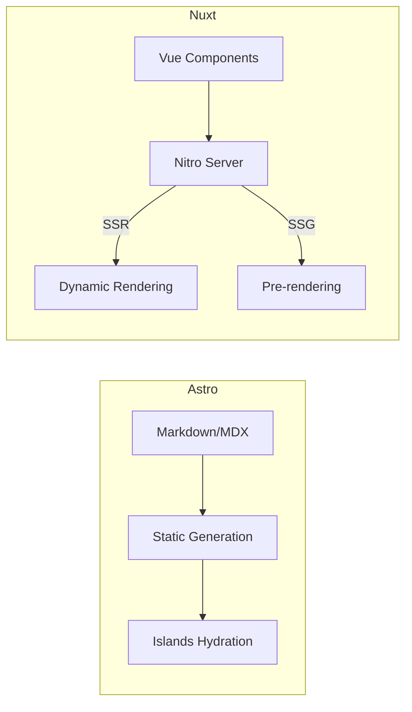
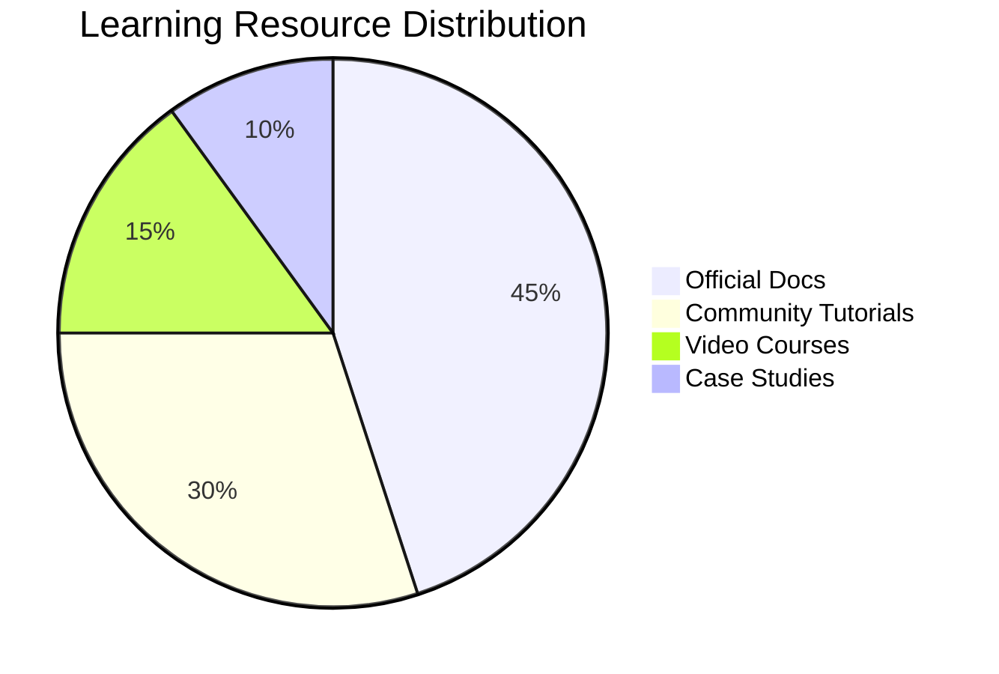
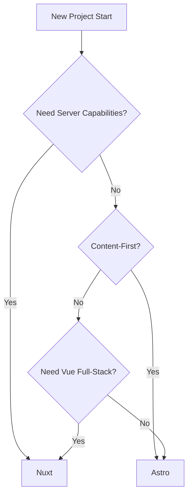

## Core Architecture Differences

### 1. Basic Architecture Comparison

| Dimension | Astro | Nuxt.js |
| --- | --- | --- |
| Core Engine | Vite + Rollup | Vite + Vue 3 |
| Rendering Mode | SSG-first, optional SSR | SSR-first, supports SSG/SPA |
| Component System | Multi-framework (React/Vue/Svelte etc.) | Vue Single File Components |
| Data Fetching | Static at build time | Dynamic at runtime |
| Routing System | File-based static routing | Dynamic + nested routing |
| Bundling Strategy | Zero JS by default, partial hydration | Full bundle + code splitting |

### 2. Architecture Diagram



## Performance Comparison

### 1. Benchmark Data

```javascript
// Test scenario: E-commerce site with 100 content pages
{
  "Metrics": ["Build Time", "First Paint", "Interaction Delay", "Memory Usage"],
  "Astro (SSG)": ["18s", "1.2s", "150ms", "1.8GB"],
  "Nuxt (SSR)": ["N/A", "2.4s", "210ms", "2.3GB"],
  "Nuxt (SSG)": ["25s", "1.5s", "180ms", "2.1GB"]
}
```

### 2. Resource Consumption Comparison

```json
{
  "$schema": "https://vega.github.io/schema/vega-lite/v5.json",
  "data": {
    "values": [
      { "framework": "Astro", "type": "JS Size", "value": 120 },
      { "framework": "Nuxt", "type": "JS Size", "value": 420 },
      { "framework": "Astro", "type": "CSS Size", "value": 80 },
      { "framework": "Nuxt", "type": "CSS Size", "value": 150 }
    ]
  },
  "mark": "bar",
  "encoding": {
    "x": { "field": "framework" },
    "y": { "field": "value", "type": "quantitative" },
    "color": { "field": "type" }
  }
}
```

## Feature Comparison

### 1. Core Feature Differences

| Feature | Astro | Nuxt.js |
| --- | --- | --- |
| Auto API Routes | Requires adapter | Built-in `/server/api` directory |
| Middleware Support | Limited (via middleware adapter) | Complete front/back-end middleware system |
| State Management | Third-party integration needed | Built-in useState/useAsyncData |
| Image Optimization | Built-in image components | Requires @nuxt/image |
| Internationalization | Via plugins | Built-in i18n module |
| Server Capabilities | Adapter-dependent | Nitro server engine |

### 2. Configuration Complexity

```javascript
// Astro i18n configuration
// astro.config.mjs
import { defineConfig } from 'astro/config';
import starlight from '@astrojs/starlight';

export default defineConfig({
  integrations: [
    starlight({
      locales: {
        root: { label: 'English', lang: 'en-US' },
        zh: { label: '简体中文', lang: 'zh-CN' }
      }
    })
  ]
});

// Nuxt i18n configuration
// nuxt.config.ts
export default defineNuxtConfig({
  modules: ['@nuxtjs/i18n'],
  i18n: {
    locales: ['en', 'zh'],
    defaultLocale: 'en',
    vueI18n: './i18n.config.ts'
  }
});
```

## Ecosystem Comparison

### 1. Module/Plugin Marketplace

| Type              | Astro                    | Nuxt.js         |
| ----------------- | ------------------------ | --------------- |
| Official Modules  | 35+                      | 50+             |
| Community Plugins | 200+                     | 1000+           |
| Featured Modules  | @astrojs/vercel          | @nuxt/image     |
| Update Frequency  | Quarterly major versions | Monthly updates |

### 2. Learning Resources



## Usage Scenario Recommendations

### Recommended for Astro

1. Content-focused marketing websites
2. Technical documentation centers
3. Legacy projects requiring multiple frameworks
4. Scenarios requiring extreme page performance

### Recommended for Nuxt.js

1. Web applications requiring server-side rendering
2. Complex interactive admin dashboards
3. Full-stack application development
4. Projects requiring deep Vue integration

## Migration Cost Analysis

### Nuxt → Astro

```markdown
- ✅ Can reuse Vue components
- ❌ Need to rewrite data fetching logic
- ⚠️ Routing system restructure
- ✅ Keep static assets
- ⚠️ Lose server capabilities
```

### Astro → Nuxt

```markdown
- ✅ Retain static content
- ❌ Convert component syntax
- ✅ Gain full SSR capabilities
- ⚠️ Add server maintenance
```

## Decision Flowchart



## Future Development Direction

| Dimension | Astro Roadmap | Nuxt.js Development |
| --- | --- | --- |
| Rendering Optimization | Enhance Islands Architecture | Optimize Nitro Server Engine |
| Data Fetching | Strengthen CMS Integration | Improve Full-Stack Type Safety |
| Deployment Support | Edge Function Adaptation | Cloud Native Deployment Enhancement |
| Developer Experience | Improve Multi-Framework Debugging | Enhance VS Code Toolchain |

## Conclusion and Recommendations

**Choose Astro when:**

- Project is content-presentation focused
- Need to mix multiple tech stacks
- Pursuing ultimate performance
- Team is familiar with static generation

**Choose Nuxt.js when:**

- Need full-stack development capabilities
- Have existing Vue tech stack foundation
- Project includes complex interactive logic
- Require server-side rendering support
