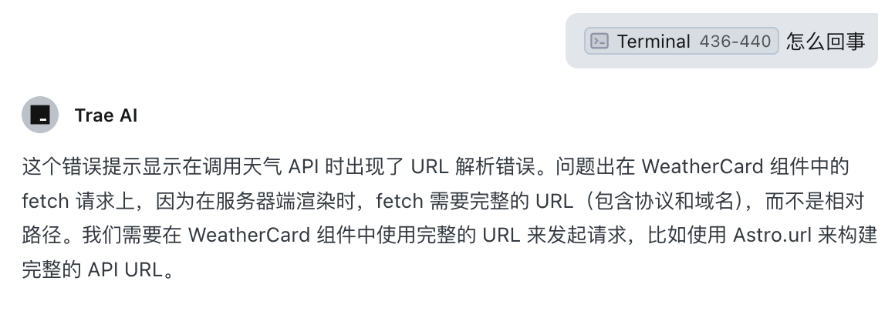

In this tutorial, we'll use the Trae editor to build an online toolbox based on JuheData's API. 🛠️

## ✨ What's Different

1. Using ByteDance's Trae editor (an AI programming tool similar to Cursor, with free access to Claude 3.5 Sonnet)
2. Using JuheData as the API provider

Most importantly, it's free, free, free! 🎉🎉🎉

## 🚀 1. Project Initialization and Environment Setup

Initialize the project directly in the editor:


Let's run it and see how it looks 🖥️🖥️🖥️


## 🎨 2. Basic Layout and Navigation Menu

Let AI create the basic layout component:

```
Modify the default layout component with these requirements:
- A top navigation bar with logo and menu items
- Menu items including:
    - Home
    - Weather Query
    - Express Tracking
    - QR Code Tools
    - Currency Converter
- A footer with copyright information
- A main content area
```


It's quite a bit slower than Cursor, but considering it's free, the pros outweigh the cons. 🐶🐶🐶

Let's see the result:


What used to take half an hour is now done in 1 minute, that's a 30x improvement in work efficiency. 🐶🐶🐶

Why even hire frontend engineers anymore, or should we lay off the current ones? 🤔🤔🤔

## 🌤️ 3. Implementing Weather Query Feature

Now let's test actual functionality, starting with the weather query feature.

### 🎴 Weather Card Component

Create a weather card component (`components/WeatherCard.vue`):

```bash
Implement a weather card component with these requirements:
- Card includes city name, date, temperature, weather, wind conditions, humidity
- Card styled using TailwindCSS
- Use mock data for testing initially

Then replace the homepage with this component.
```

I noticed the operation failed, but it seemed to think and retry on its own:


However, the generated code still had errors, but we could click AI Fix directly:


And then we can see the fixed result:


Now that's better, what used to take an hour is done in 1 minute, that's a 60x improvement in work efficiency. 🐶🐶🐶

### 🔌 API Implementation

Frontend is just a few web pages, what's the difficulty? Now let's see how you implement the API.

```bash
Implement a weather query API for the weather card component to use, with these requirements:
- Use JuheData's API
- Return format should match the weather card component's requirements
```

It failed, but no worries, let's ask it how to solve it by just clicking a button:


Then it will think and provide a solution:



I wanted to understand the entire API request process, so I asked it to add some logs:

```bash
Add detailed logs to help me understand the complete process of frontend requesting backend API
```

> This is a very good habit, after all, AI can make mistakes too, so we need logs to record the entire process for debugging


Turns out we forgot to configure the JuheData API, after configuring it, finally succeeded:


Now that's better, what used to take an hour is done in 1 minute, that's a 60x improvement in work efficiency. 🐶🐶🐶

Maybe one day, I'll just enter my username and password, and AI will automatically help me log into JuheData, automatically call the API, automatically return the data, and automatically display it on the page. Then can I just take a break? 🤔🤔🤔

I suggest JuheData create a system where you can generate products just by talking, even handle deployment for me, and all I need to do is:

- Input my requirements, and it automatically generates the product
- Then automatically deploys it
- Then automatically launches it
- Then automatically promotes it
- Then automatically makes money for me

Then can I just take a break? 🤔🤔🤔 