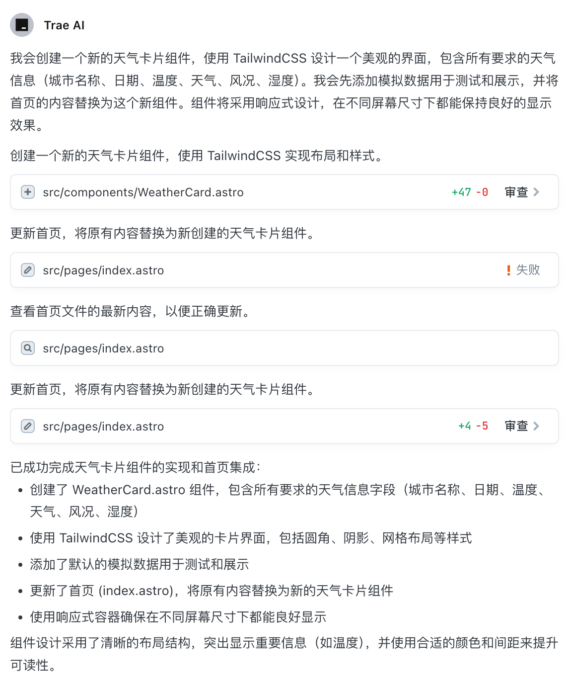

在本教程中，我们将使用 Trae 编辑器，基于聚合数据的 API 构建一个在线工具箱。 🛠️

## ✨ 有何不同

1. 使用字节跳动的 Trae 编辑器（类似 Cursor 的 AI 编程工具，免费使用 Claude 3.5 Sonnet）
2. 使用聚合数据作为 API 提供商

最重要的是免费，免费，免费！🎉🎉🎉

## 🚀 1. 项目初始化和环境配置

直接在编辑器中初始化项目：


运行起来看看效果 🖥️🖥️🖥️


## 🎨 2. 基础布局与导航菜单

让 AI 来创建基础布局组件:

```
修改默认的布局组件，要求：
- 有一个顶部的导航栏，包含 logo 和菜单项
- 菜单项包括
    - 首页
    - 天气查询
    - 快递查询
    - 二维码工具
    - 汇率转换
- 有一个底部的页脚，包含版权信息
- 有一个主内容区域
```


速度要比 Cursor 慢不少，不过考虑它是免费的，瑕不掩瑜啊。🐶🐶🐶

看看效果：


原来半小时的工作量，1分钟就搞定了，工作效率提升了 30 倍。🐶🐶🐶

这还招什么前端工程师，甚至现在的要不要开除呢？🤔🤔🤔

## 🌤️ 3. 天气查询功能实现

现在开始测试实际的功能，先实现天气查询功能。

### 🎴 天气卡片组件

创建天气卡片组件 (`components/WeatherCard.vue`):

```bash 
实现一个天气卡片组件，要求：
- 卡片包含城市名称、日期、温度、天气、风况、湿度
- 卡片使用 TailwindCSS 进行样式设计
- 暂时使用模拟的数据来测试

然后首页替换成这个组件。
```

我注意到操作有失败，但是它好像会思考一样，自己又重试了一次：



不过，生成的代码还是存在错误，但是可以直接点击 AI修复：


然后就可以看到修复后的效果：


这下好了，1个小时的工作量，1分钟就搞定了，工作效率提升了 60 倍。🐶🐶🐶

### 🔌 API 实现

前端不就是几个网页嘛，有什么难度，现在看看你怎么实现 API 吧。

```bash
实现一个天气查询的 API 供刚才的天气卡片组件使用，要求：
- 使用聚合数据的 API
- 返回格式满足刚才的天气卡片组件的需求
```

出错了，不过没关系，问问它怎么解决，只需要点一下按钮：


然后它就会自己思考，然后给出解决方案：


我想了解整个请求API的过程，所以让它加一些日志：

```bash 
加入详细的日志，让我了解前端请求后端API的完整过程
```

> 这是一个非常好的习惯，毕竟 AI 也是会出错的，所以需要有日志来记录整个过程，方便调试


原来是忘记配置聚合数据的 API 了，配置一下，终于成功了：


这下好了，1个小时的工作量，1分钟就搞定了，工作效率提升了 60 倍。🐶🐶🐶

也许有一天，我输入我的用户名和密码，AI 自动帮我登录聚合数据，然后自动帮我调用 API，然后自动帮我返回数据，然后自动帮我显示在页面上，那我岂不是可以休息了？🤔🤔🤔

建议聚合数据做一套说话就能生成产品的网页，连部署都给我搞定，然后我只要：

- 输入我的需求，它就能自动帮我生成产品，
- 然后自动帮我部署
- 然后自动帮我上线
- 然后自动帮我推广
- 然后自动帮我赚钱

那我岂不是可以休息了？🤔🤔🤔