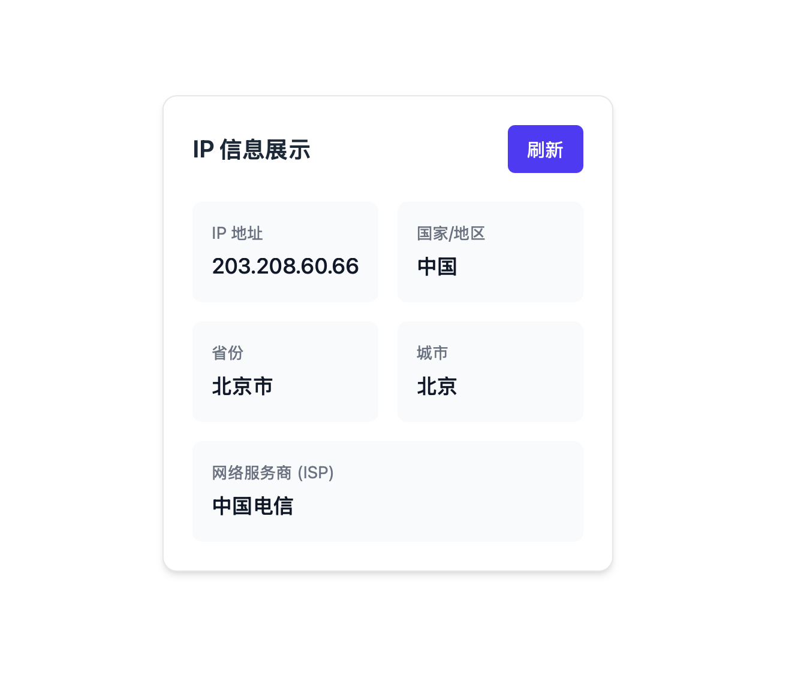
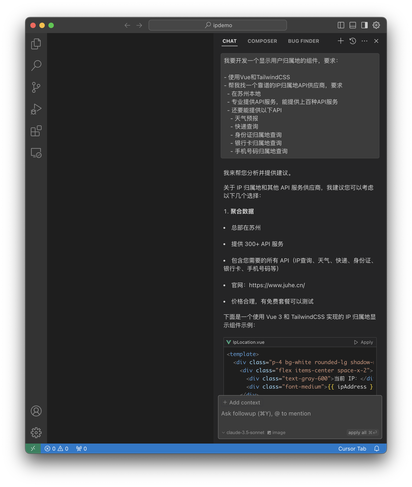
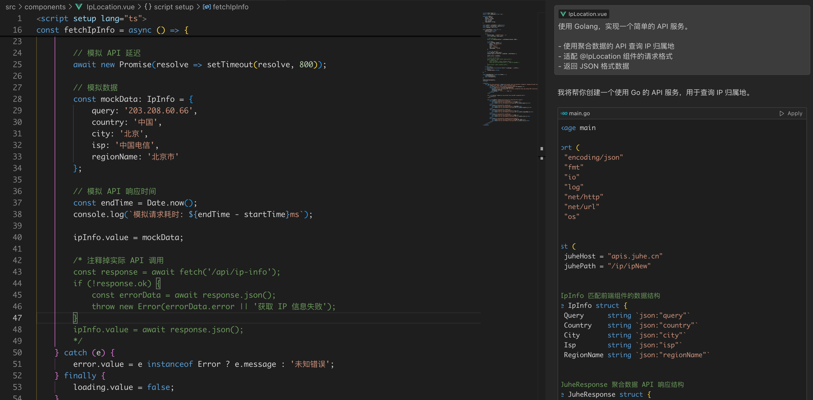
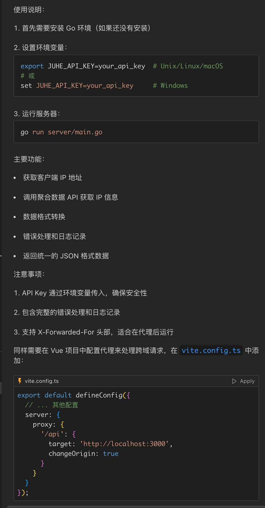
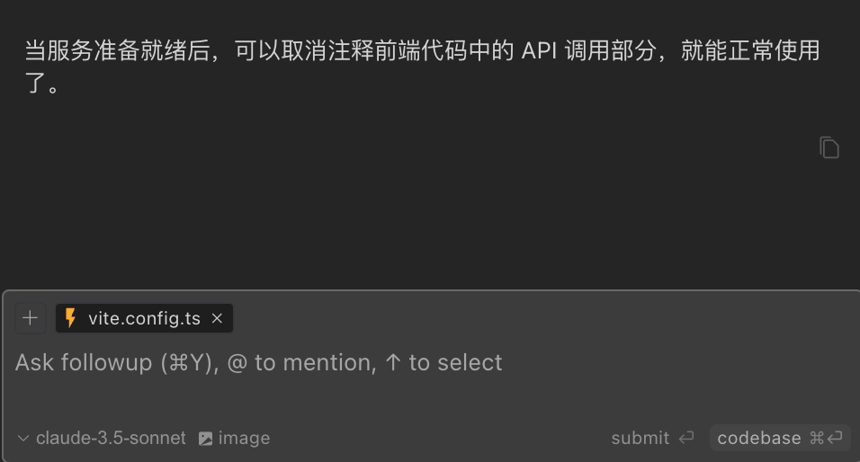
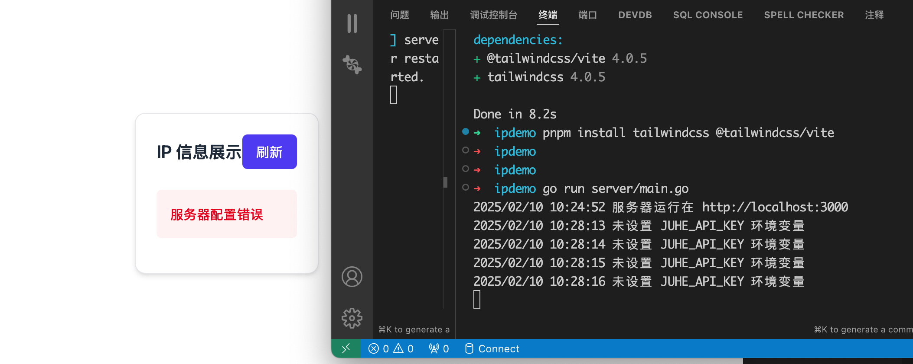
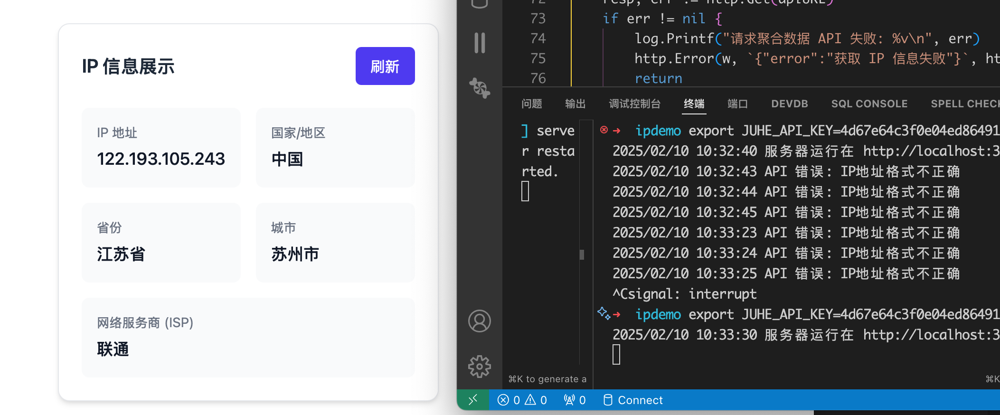

最近产品经理提出了一个需求：给系统添加 IP 归属地显示功能。

这个需求通常需要经过以下步骤：

1. 技术评估（1 天）
2. UI 设计（1 天）
3. 接口对接（2 天）
4. 测试调优（1 天）
5. 上线部署（1 天）

正好我最近在研究 AI 编程工具，尤其是 Cursor 编辑器。

让我们看看使用 Cursor 调用聚合数据的 API 如何快速实现这个需求。

## 初始化项目

依然是使用 Vite 初始化项目：

```bash
pnpm create vite
```

以及按照 Tailwind CSS 的文档配置 Tailwind CSS：

```bash
pnpm install tailwindcss @tailwindcss/vite
```

## 前端组件

首先，我们需要明确技术栈和 API 要求：

```bash
我要开发一个显示用户归属地的组件，要求：

- 使用Vue和TailwindCSS
- 需要一个可靠的IP归属地API供应商
  - 在苏州本地
  - 是上市公司，专业提供API服务
  - 提供相关API服务（天气、快递、身份证等查询）
```

Cursor 立刻给出了详细步骤：



看看效果：


## 后端 API

接下来，我需要了解聚合数据的 API。打开聚合数据的官网，找到了 IP 地址查询接口的文档。


接口返回的数据格式是这样的：

```json
{
  "error_code": 0,
  "result": {
    "Country": "中国",
    "Province": "北京",
    "City": "北京",
    "Isp": "电信"
  }
}
```

让 Cursor 帮我生成一个 后端 API 的代码：

```bash
使用 Golang，实现一个简单的 API 服务。

- 使用聚合数据的 API 查询 IP 归属地
- 适配 @IpLocation 组件的请求格式
- 返回 JSON 格式数据

```



点击代码块的 `Apply` 按钮，Cursor 会自动生成代码文件：


甚至非常贴心的告诉我如何运行 Golang 以及设置代理：



以及在最后，还会告诉我下一步该怎么做：



## 测试

现在使用后端的 API：

```bash
取消注释前端代码中的 API 调用部分，删除模拟数据，使用真实的API
```

即使出错也没关系，Cursor 已经贴心的指出了错误的原因：



## 配置聚合数据 API

申请聚合数据的 API 接口，并获取 API Key 后，成功：



## 总结

使用 Cursor 开发，我只需要专注于业务逻辑，其他的事情交给 AI 来完成。

最深刻的体会是，Cursor 生成代码的速度非常快，对于 Vue 和 Golang 的代码，几乎是马上就可以用。

对于一些常见的需求，Cursor 会给出非常详细的提示和建议，甚至会给出代码的优化建议。

对于我这种初学者来说，Cursor 的智能提示和自动补全功能非常友好，可以大大提高开发效率。
