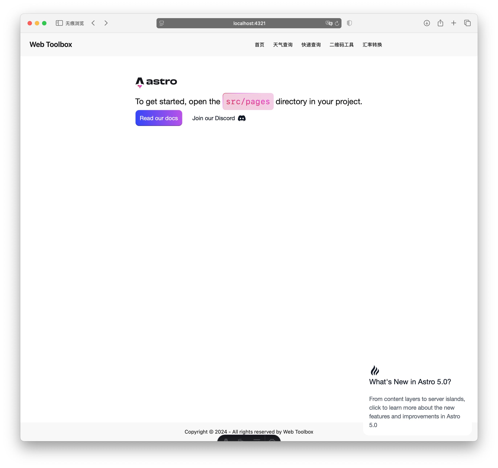

在这一节中，我们将实现网站的基础布局和导航菜单。一个好的布局不仅要美观，还要具有良好的用户体验和可维护性。

## 更新布局组件

这里的代码可以由 AI 生成，你可以这样对 AI 说：

```bash
生成一个基础布局组件，要求：
- 使用 TailwindCSS 和 DaisyUI 实现响应式导航菜单，并添加页脚
- 使用 Astro 实现布局组件，并添加导航菜单项
- 代码写入 src/layouts/Layout.astro 文件中
```

以下是我的到的代码，供你参考：

```astro
<!-- src/layouts/Layout.astro -->
---
import '../app.css';

// 导航菜单项
const menuItems = [
  { name: '首页', path: '/' },
  { name: '天气查询', path: '/weather' },
  { name: '快递查询', path: '/express' },
  { name: '二维码工具', path: '/tools/qrcode' },
  { name: '汇率转换', path: '/tools/currency' }
]
---

<html lang="zh-CN">
<head>
  <meta charset="UTF-8">
  <meta name="viewport" content="width=device-width, initial-scale=1.0">
  <meta name="description" content="Web Toolbox - 您的在线工具箱">
  <title>Web Toolbox</title>
</head>
<body>
  <div class="min-h-screen bg-base-100 flex flex-col">
    <!-- 导航栏 -->
    <nav class="navbar bg-base-200">
      <div class="navbar-start">
        <!-- Logo -->
        <a href="/" class="btn btn-ghost text-xl">Web Toolbox</a>
      </div>

      <!-- 导航菜单 -->
      <div class="navbar-center">
        <ul class="menu menu-horizontal px-1">
          {menuItems.map(item => (
            <li>
              <a href={item.path}>{item.name}</a>
            </li>
          ))}
        </ul>
      </div>
    </nav>

    <!-- 主要内容 -->
    <main class="container mx-auto px-4 py-8 flex-grow">
      <slot />
    </main>

    <!-- 页脚 -->
    <footer class="footer footer-center p-4 bg-base-200 text-base-content mt-auto">
      <div>
        <p>Copyright © 2024 - All rights reserved by Web Toolbox</p>
      </div>
    </footer>
  </div>
</body>
</html>
```

## 预览效果

打开浏览器，访问 `http://localhost:4321`，可以看到如下效果：



## 下一步

现在我们已经完成了基础布局和导航菜单的实现，接下来我们将：

1. 实现天气查询功能
2. 设计天气卡片组件
3. 集成天气 API
4. 添加城市搜索功能