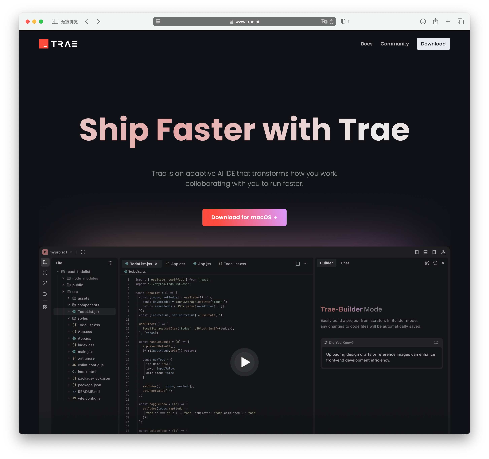

在这个系列教程中，我们将从零开始开发一个功能丰富的在线工具箱网站。

## 有何不同 ✨

我们将使用一款 AI 编辑器，来完成这个系列教程，这个教程有些不同：

- 🎯 你甚至可以不需要有编程基础也能轻松完成
- 🚀 最后会将项目部署到云服务器上，这意味着任何人都可以访问你的在线工具箱

## 技术栈 🛠️

如果你有一定的技术基础，你也许想了解下这个项目的技术栈：

- **编程语言**：[TypeScript](https://www.typescriptlang.org/) 
- **前端框架**：[Astro](https://astro.build/) 
- **UI 框架**：
  - [TailwindCSS](https://tailwindcss.com/) 
  - [DaisyUI](https://daisyui.com/) 
- **API 供应商**：[聚合数据](https://www.juhe.cn/) 
- **部署**：[Netlify](https://www.netlify.com/) 

## 注意事项

- ⚠️ 中国大陆用户需要保证自己的网络能访问 GitHub

让我们开始构建属于你的在线工具箱吧！ 🎉
