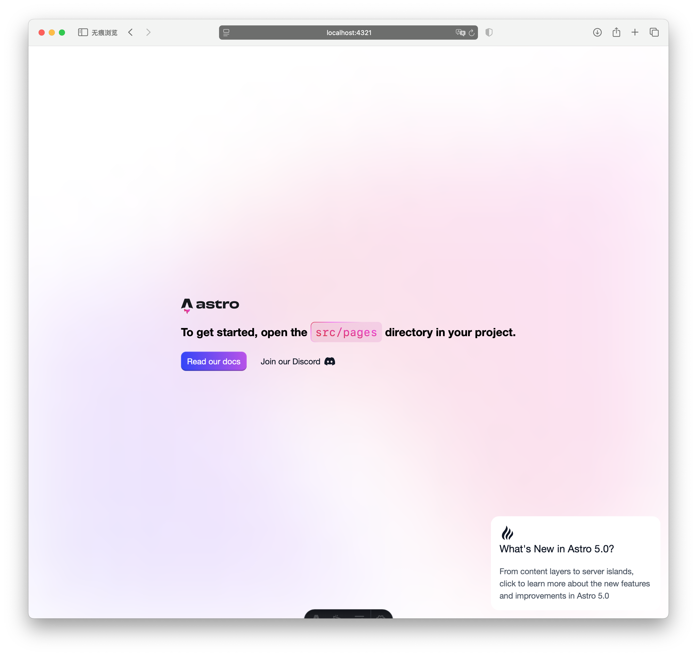

import Tabs from '@components/tabs/Tabs.astro';
import TabItem from '@components/tabs/TabItem.astro';

在开始开发我们的在线工具箱项目之前，我们需要先配置好必要的开发环境。本文将指导你完成所有环境配置步骤。

## 安装 Node.js

1. 访问 [Node.js 官网](https://nodejs.org/)
2. 下载并安装 LTS（长期支持）版本
3. 安装完成后，打开终端验证安装：

```bash
# 检查 Node.js 版本
node --version

# 检查 npm 版本
npm --version
```

确保 Node.js 版本 >= 16.0.0。

## 安装 pnpm

我们将使用 pnpm 作为项目的包管理工具，它比 npm 更快、更节省空间。

1. 使用 npm 安装 pnpm：

```bash
# 使用 npm 安装 pnpm
npm install -g pnpm

# 验证安装
pnpm --version
```

2. 验证 pnpm 安装成功后，我们就可以使用它来管理项目依赖了。

## 安装 Trae

访问 [Trae 官网](https://trae.ai/) 下载安装即可。

## 安装 Git

1. 访问 [Git 官网](https://git-scm.com/)
2. 下载并安装 Git
3. 配置 Git 全局设置：

```bash
# 设置用户名和邮箱
git config --global user.name "你的名字"
git config --global user.email "你的邮箱"

# 验证配置
git config --list
```

## 创建 GitHub 账号

1. 访问 [GitHub](https://github.com/)
2. 注册新账号或登录已有账号
3. 配置 SSH 密钥（推荐）：

```bash
# 生成 SSH 密钥
ssh-keygen -t ed25519 -C "你的邮箱"

# 复制公钥内容
cat ~/.ssh/id_ed25519.pub
```

4. 将公钥添加到 GitHub 账号设置中

## 安装 GitHub Desktop

按照官网 [GitHub Desktop](https://desktop.github.com/) 的指引安装即可。

## 初始化项目

在开始开发之前，我们需要先初始化项目。我们将按照以下三个主要步骤来进行：

1. 使用 pnpm 创建 Astro 项目
2. 使用 GitHub Desktop 推送项目
3. 安装配置 Tailwind CSS 和 DaisyUI

### 第一步：创建 Astro 项目

1. 创建 Astro 项目：

<Tabs>
  <TabItem label="AI提示词">
    你可使用以下 AI 提示词来初始化一个 Astro 项目：
```bash
初始化一个 Astro 项目，要求：
- 项目名称为 web-toolbox，
- 使用 pnpm 作为包管理工具，
- 使用 TypeScript 作为编程语言，
- 使用 Tailwind CSS 和 DaisyUI 作为样式库，
- 使用 Vue 作为组件库。
```
  </TabItem>
  <TabItem label="参考代码">
    ```bash
    # 创建项目
    pnpm create astro@latest web-toolbox

    # 按照提示进行配置：
    # 1. 选择基础模板
    # 2. 选择安装依赖
    # 3. 选择使用 TypeScript（推荐）
    # 4. 选择 Strict 类型检查（推荐）

    # 进入项目目录
    cd web-toolbox
    ```
  </TabItem>
</Tabs>

2. 启动项目并查看：

<Tabs>
  <TabItem label="AI提示词">
    你可使用以下 AI 提示词来启动项目：
```bash
启动项目
```
  </TabItem>
  <TabItem label="参考代码">
    ```bash
    pnpm dev
    ```
  </TabItem>
</Tabs>

打开其中展示的网址，会看到以下界面：



### 第二步：使用 GitHub Desktop 推送项目

由于 Astro 在初始化项目时已经完成了 Git 仓库的配置，我们只需要使用 GitHub Desktop 将项目推送到 GitHub 即可。

1. 添加本地项目：
   - 打开 GitHub Desktop
   - 点击 "File" > "Add Local Repository"
   - 选择项目所在目录（web-toolbox 文件夹）
   - GitHub Desktop 会自动识别这是一个 Git 仓库

2. 创建 GitHub 仓库：
   - 点击 "Publish repository"
   - 填写仓库信息：
     - Name: web-toolbox
     - Description: 在线工具箱项目
     - 选择是否保持仓库私有（推荐选择 Public）
   - 点击 "Publish Repository"

现在你的项目已经成功托管到 GitHub 上了。你可以通过 GitHub Desktop 方便地进行代码的提交、推送和拉取操作。

### 第三步：安装配置 Tailwind CSS

1. 安装 Tailwind CSS 集成：

<Tabs>
  <TabItem label="AI提示词">
    你可使用以下 AI 提示词来安装 Tailwind CSS 集成：
    ```bash
    安装 Astro Tailwind 集成
    ```
  </TabItem>
  <TabItem label="参考代码">
    ```bash
    pnpm astro add tailwind
    ```
  </TabItem>
</Tabs>

2. 配置 Tailwind CSS（`tailwind.config.mjs`）：

<Tabs>
  <TabItem label="AI提示词">
    你可使用以下 AI 提示词来配置 Tailwind CSS：
    ```bash
    配置 Tailwind CSS
    ```
  </TabItem>
  <TabItem label="参考代码">
    ```javascript
    /** @type {import('tailwindcss').Config} */
    export default {
      content: ['./src/**/*.{astro,html,js,jsx,md,mdx,svelte,ts,tsx,vue}'],
      theme: {
        extend: {},
      }
    ```
  </TabItem>
</Tabs>

3. 创建全局样式文件（`src/styles/global.css`）：

<Tabs>
  <TabItem label="AI提示词">
    你可使用以下 AI 提示词来创建全局样式文件：
    ```bash
    创建 Tailwind CSS 全局样式文件
    ```
  </TabItem>
  <TabItem label="参考代码">
    ```css
    @tailwind base;
    @tailwind components;
    @tailwind utilities;
    ```
  </TabItem>
</Tabs>

4. 在布局文件中引入样式（`src/layouts/Layout.astro`）：

<Tabs>
  <TabItem label="AI提示词">
    你可使用以下 AI 提示词来在布局文件中引入样式：
    ```bash
    在布局文件中引入样式
    ```
  </TabItem>
  <TabItem label="参考代码">

    ```astro
    ---
    import '../styles/global.css';
    ---

    <!DOCTYPE html>
    <html lang="zh-CN">
      <head>
        <meta charset="UTF-8" />
        <meta name="viewport" content="width=device-width" />
        <title>在线工具箱</title>
      </head>
      <body>
        <slot />
      </body>
    </html>
```
  </TabItem>
</Tabs>

### 第四步：安装配置 DaisyUI

1. 安装 DaisyUI：

<Tabs>
  <TabItem label="AI提示词">
    你可使用以下 AI 提示词来安装 DaisyUI：
    ```bash
    安装 DaisyUI
    ```
  </TabItem>
  <TabItem label="参考代码">
    ```bash
    # 安装 DaisyUI
    pnpm add -D daisyui
    ```
  </TabItem>
</Tabs>

2. 在 Tailwind CSS 配置中添加 DaisyUI 插件（`tailwind.config.mjs`）：

<Tabs>
  <TabItem label="AI提示词">
    你可使用以下 AI 提示词来在 Tailwind CSS 配置中添加 DaisyUI 插件：
    ```bash
    在 Tailwind CSS 配置中添加 DaisyUI 插件
    ```
  </TabItem>
  <TabItem label="参考代码">
```javascript
/** @type {import('tailwindcss').Config} */
export default {
  content: ['./src/**/*.{astro,html,js,jsx,md,mdx,svelte,ts,tsx,vue}'],
  theme: {
    extend: {},
  },
  plugins: [require("daisyui")],
  daisyui: {
    themes: true,
  },
}
```
  </TabItem>
</Tabs>

3. 验证安装：
   - 重启开发服务器
   - 在任意组件中使用 DaisyUI 的组件类名
   - 确认样式是否正确应用

### 第五步：启用 SSR 模式

由于我们的在线工具箱需要通过后端 API 获取远程数据（如天气、汇率等），为了确保：

1. 更好的 SEO 优化
2. 更快的首屏加载
3. 避免客户端 API 密钥泄露
4. 统一的数据获取方式

我们需要启用 Astro 的 SSR（服务端渲染）模式。

1. 修改 `astro.config.mjs` 配置：

<Tabs>
  <TabItem label="AI提示词">
    你可使用以下 AI 提示词来修改 `astro.config.mjs` 配置：
    ```bash
    修改 Astro 配置启用 SSR 模式
    ```
  </TabItem>
  <TabItem label="参考代码">
    ```javascript
    import { defineConfig } from 'astro/config';
    import vue from '@astrojs/vue';
    import tailwind from '@astrojs/tailwind';

export default defineConfig({
  output: 'server',  // 启用 SSR 模式
  adapter: 'node',   // 使用 Node.js 适配器
  integrations: [
    vue(),
    tailwind(),
  ],
});
```
  </TabItem>
</Tabs>

2. 创建环境变量文件（`.env`）：

<Tabs>
  <TabItem label="AI提示词">
    你可使用以下 AI 提示词来创建环境变量文件：
    ```bash
    创建环境变量文件来存储我的聚合数据 API 密钥
    ```
  </TabItem>
  <TabItem label="参考代码">
    ```plaintext
    JUHE_API_KEY=你的聚合数据API密钥
```
  </TabItem>
</Tabs>

3. 在 `.gitignore` 中添加环境变量文件：

<Tabs>
  <TabItem label="AI提示词">
    你可使用以下 AI 提示词来在 `.gitignore` 中添加环境变量文件：
    ```bash
    在 `.gitignore` 中添加环境变量文件
    ```
  </TabItem>
  <TabItem label="参考代码">
```plaintext
# 环境变量
.env
.env.*
!.env.example
```
  </TabItem>
</Tabs>

### 第六步：安装配置 Vue

<Tabs>
  <TabItem label="AI提示词">
    你可使用以下 AI 提示词来安装 Vue 集成：

    ```bash
    安装 Astro Vue 集成
    ```

  </TabItem>
  <TabItem label="参考代码">
  以下是我的到的代码，供你参考：

    ```bash 
    # 安装 Astro Vue 集成
    pnpm astro add vue
    ```
  </TabItem>
</Tabs>

### 启动开发服务器

```bash
pnpm dev
```

访问 `http://localhost:4321` 查看项目。