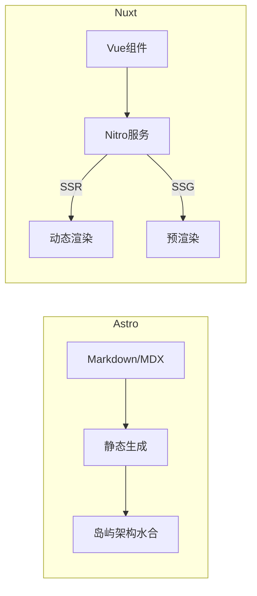
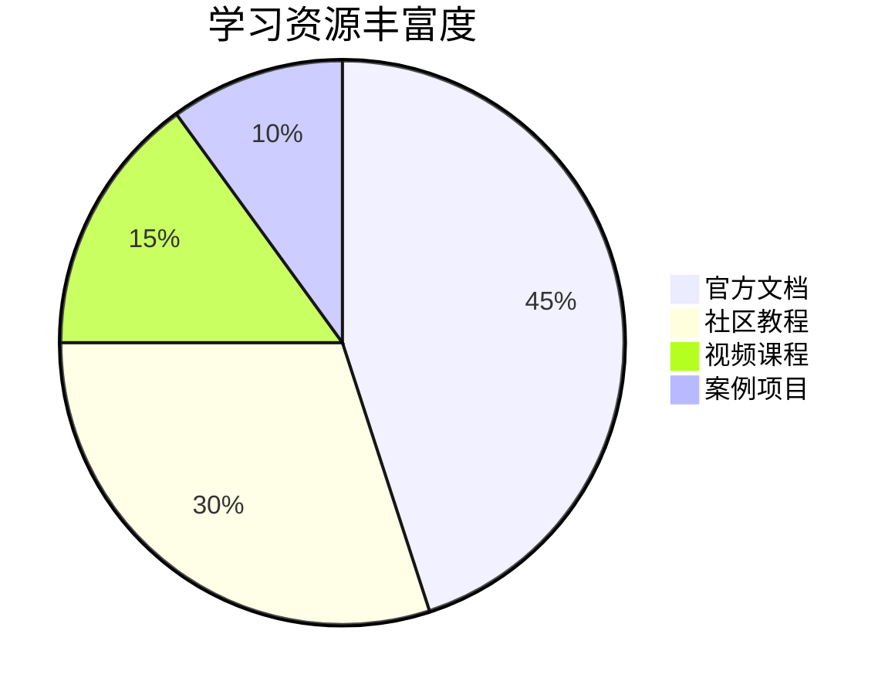
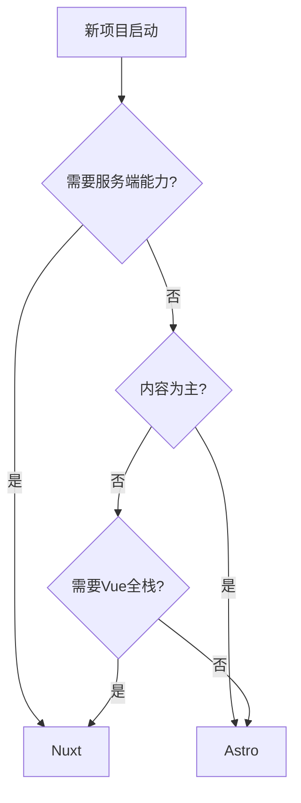

## 核心架构差异

### 1. 基础架构对比

| 维度     | Astro                         | Nuxt.js                |
| -------- | ----------------------------- | ---------------------- |
| 核心引擎 | Vite + Rollup                 | Vite + Vue 3           |
| 渲染模式 | SSG 优先，可选 SSR            | SSR 优先，支持 SSG/SPA |
| 组件系统 | 多框架（React/Vue/Svelte 等） | Vue 单文件组件         |
| 数据获取 | 构建时静态获取                | 运行时动态获取         |
| 路由系统 | 文件式静态路由                | 动态路由 + 嵌套路由    |
| 打包策略 | 零 JS 默认，按需水合          | 全量打包 + 代码分割    |

### 2. 架构示意图



## 性能表现对比

### 1. 基准测试数据

```javascript
// 测试场景：100个内容页面的电商网站
{
  "指标": ["构建时间", "首屏加载", "交互延迟", "内存占用"],
  "Astro (SSG)": ["18s", "1.2s", "150ms", "1.8GB"],
  "Nuxt (SSR)": ["N/A", "2.4s", "210ms", "2.3GB"],
  "Nuxt (SSG)": ["25s", "1.5s", "180ms", "2.1GB"]
}
```

### 2. 资源消耗对比

```json
{
  "$schema": "https://vega.github.io/schema/vega-lite/v5.json",
  "data": {
    "values": [
      { "framework": "Astro", "type": "JS Size", "value": 120 },
      { "framework": "Nuxt", "type": "JS Size", "value": 420 },
      { "framework": "Astro", "type": "CSS Size", "value": 80 },
      { "framework": "Nuxt", "type": "CSS Size", "value": 150 }
    ]
  },
  "mark": "bar",
  "encoding": {
    "x": { "field": "framework" },
    "y": { "field": "value", "type": "quantitative" },
    "color": { "field": "type" }
  }
}
```

## 功能特性对比

### 1. 核心功能差异

| 功能          | Astro                    | Nuxt.js                    |
| ------------- | ------------------------ | -------------------------- |
| 自动 API 路由 | 需通过适配器实现         | 内置 `/server/api` 目录    |
| 中间件支持    | 有限（通过中间件适配器） | 完整的前后端中间件体系     |
| 状态管理      | 需集成第三方库           | 内置 useState/useAsyncData |
| 图片优化      | 内置图片组件             | 需使用 @nuxt/image         |
| 国际化        | 通过插件实现             | 内置 i18n 模块             |
| 服务端能力    | 依赖适配器               | Nitro 服务引擎             |

### 2. 配置复杂度

```javascript
// Astro 国际化配置
// astro.config.mjs
import { defineConfig } from 'astro/config';
import starlight from '@astrojs/starlight';

export default defineConfig({
  integrations: [
    starlight({
      locales: {
        root: { label: '简体中文', lang: 'zh-CN' },
        en: { label: 'English', lang: 'en-US' }
      }
    })
  ]
});

// Nuxt 国际化配置
// nuxt.config.ts
export default defineNuxtConfig({
  modules: ['@nuxtjs/i18n'],
  i18n: {
    locales: ['zh', 'en'],
    defaultLocale: 'zh',
    vueI18n: './i18n.config.ts'
  }
});
```

## 生态系统对比

### 1. 模块/插件市场

| 类型     | Astro           | Nuxt.js     |
| -------- | --------------- | ----------- |
| 官方模块 | 35+             | 50+         |
| 社区插件 | 200+            | 1000+       |
| 特色模块 | @astrojs/vercel | @nuxt/image |
| 更新频率 | 季度大版本      | 月度更新    |

### 2. 学习资源



## 使用场景建议

### 推荐 Astro 的场景

1. 内容为主的营销网站
2. 技术文档中心
3. 需要混合多框架的遗留项目
4. 对页面性能要求极高的场景

### 推荐 Nuxt.js 的场景

1. 需要服务端渲染的 Web 应用
2. 复杂用户交互的管理后台
3. 全栈应用开发
4. 需要深度 Vue 集成的项目

## 迁移成本分析

### Nuxt → Astro

```markdown
- ✅ 可复用 Vue 组件
- ❌ 重写数据获取逻辑
- ⚠️ 路由系统重构
- ✅ 保持静态资源
- ⚠️ 失去服务端能力
```

### Astro → Nuxt

```markdown
- ✅ 保留静态内容
- ❌ 转换组件语法
- ✅ 获得完整 SSR 能力
- ⚠️ 增加服务端运维
```

## 决策流程图



## 未来发展方向

| 维度       | Astro 路线图     | Nuxt.js 发展         |
| ---------- | ---------------- | -------------------- |
| 渲染优化   | 增强岛屿架构性能 | 优化 Nitro 服务引擎  |
| 数据获取   | 强化 CMS 集成    | 完善全栈数据类型安全 |
| 部署支持   | 边缘函数适配     | 云原生部署增强       |
| 开发者体验 | 改进多框架调试   | 增强 VS Code 工具链  |

## 总结建议

**选择 Astro 当：**

- 项目以内容展示为核心
- 需要混合多技术栈
- 追求极致性能表现
- 团队熟悉静态生成模式

**选择 Nuxt.js 当：**

- 需要全栈开发能力
- 已有 Vue 技术栈基础
- 项目包含复杂交互逻辑
- 需要服务端渲染支持
