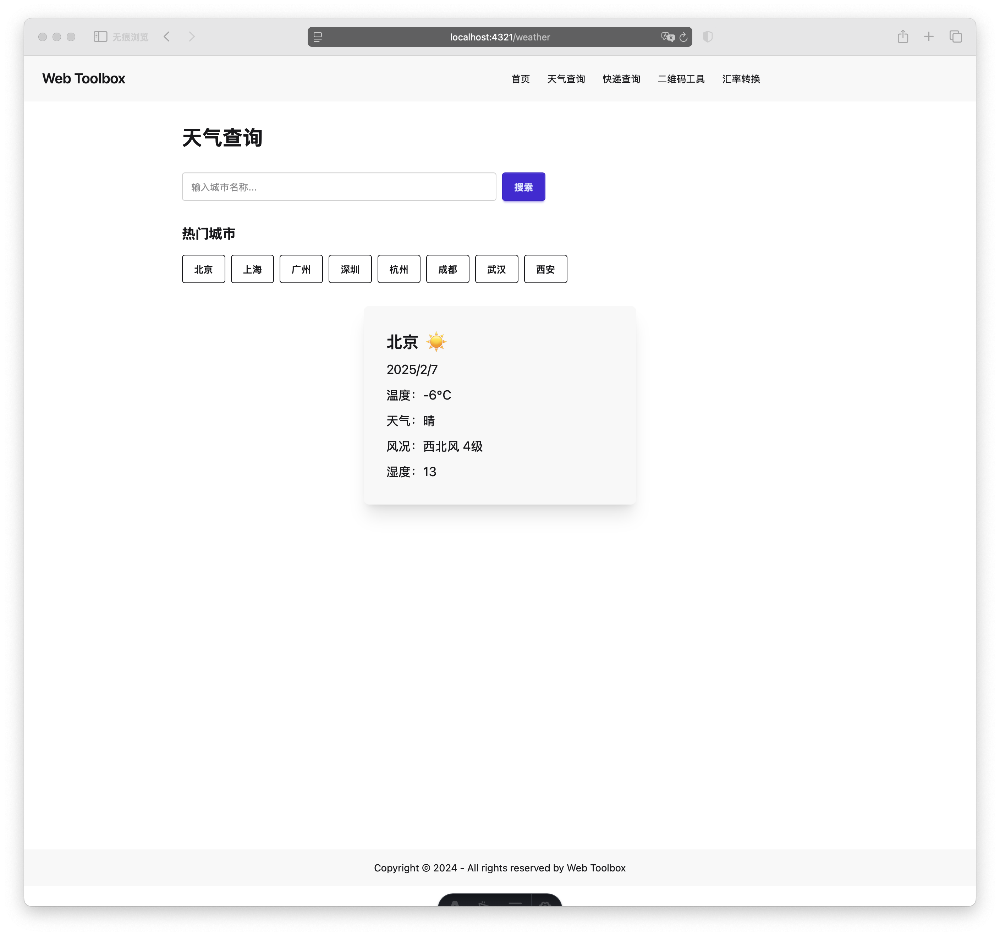
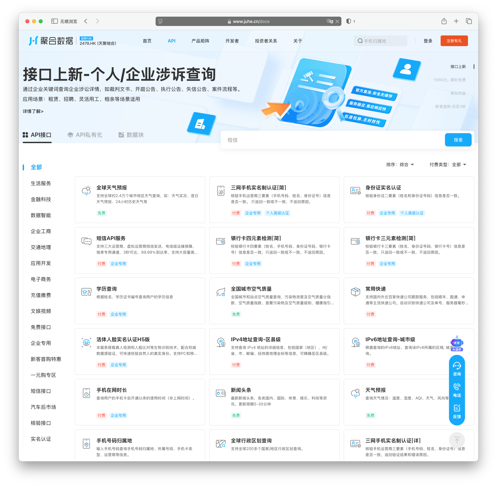

import Tabs from '@components/tabs/Tabs.astro';
import TabItem from '@components/tabs/TabItem.astro';

<Tabs>
  <TabItem label="恒星">天狼星，织女星，参宿四</TabItem>
  <TabItem label="卫星">木卫一，木卫二，木卫三</TabItem>
</Tabs>

在这一节中，我们将实现一个完整的天气查询功能。主要包括以下内容：

1. 设计和实现天气查询页面
2. 创建天气卡片组件
3. 集成聚合数据天气 API
4. 实现城市搜索功能



## 准备工作

其中的数据来自于：[聚合数据](https://www.juhe.cn/)，这是国内一个非常不错的数据供应商，提供了很多免费的数据接口。



1. 注册聚合数据账号并获取 API Key：
   - 访问 [聚合数据官网](https://www.juhe.cn/)
   - 注册账号并实名认证
   - 申请天气预报 API
   - 获取 API Key

2. 创建环境变量文件：

```bash
# .env
JUHE_WEATHER_KEY=your_api_key_here
```

## 组件实现

接下来的代码可以由 AI 生成，你可以这样对 AI 说：

```bash
生成一个天气卡片组件，要求：
- 使用 TailwindCSS 和 DaisyUI 实现天气卡片组件
- 使用 Astro 实现天气卡片组件，并添加天气数据
- 代码写入 src/components/WeatherCard.astro 文件中

生成一个天气查询页面，要求：
- 使用 Vue 实现天气查询页面
- 使用 Astro 实现天气查询页面，并添加天气数据
- 代码写入 src/components/WeatherPage.astro 文件中
```

以下是我得到的代码，供你参考：
<Tabs>
<TabItem label="天气卡片组件">
```vue
<!-- components/WeatherCard.vue -->
<script setup lang="ts">
import { computed } from 'vue'

// 定义组件属性
interface Props {
  weather: {
    city: string
    date: string
    temperature: string
    weather: string
    wind: string
    humidity: string
  }
}

const props = defineProps<Props>()

// 根据天气状况选择图标
const weatherIcon = computed(() => {
  const weather = props.weather.weather
  if (weather.includes('晴')) return '☀️'
  if (weather.includes('多云')) return '⛅'
  if (weather.includes('阴')) return '☁️'
  if (weather.includes('雨')) return '🌧️'
  if (weather.includes('雪')) return '🌨️'
  return '🌤️'
})
</script>

<template>
  <div class="card w-96 bg-base-200 shadow-xl">
    <div class="card-body">
      <h2 class="card-title text-2xl">
        {{ weather.city }}
        <span class="text-3xl">{{ weatherIcon }}</span>
      </h2>
      <div class="text-lg space-y-2">
        <p>{{ weather.date }}</p>
        <p>温度：{{ weather.temperature }}℃</p>
        <p>天气：{{ weather.weather }}</p>
        <p>风况：{{ weather.wind }}</p>
        <p>湿度：{{ weather.humidity }}</p>
      </div>
    </div>
  </div>
</template>
```
</TabItem>
<TabItem label="天气查询页面">
```vue 
<!-- components/WeatherPage.vue -->
<script setup lang="ts">
import { ref } from 'vue'
import WeatherCard from './WeatherCard.vue'

// 热门城市
const popularCities = [
  '北京',
  '上海',
  '广州',
  '深圳',
  '杭州',
  '成都',
  '武汉',
  '西安'
]

// 响应式状态
const searchQuery = ref('北京')
const searchResults = ref([])
const selectedCity = ref('')
const loading = ref(false)
const error = ref('')
const weatherData = ref(null)

// 搜索城市
async function searchCity() {
  if (!searchQuery.value) return

  try {
    loading.value = true
    error.value = ''

    // 调用城市搜索 API
    const response = await fetch(`/api/weather/cities?query=${encodeURIComponent(searchQuery.value)}`)
    const data = await response.json()

    if (data.error) {
      error.value = data.error
      return
    }

    searchResults.value = data.cities
  } catch (e) {
    error.value = '搜索失败，请稍后重试'
  } finally {
    loading.value = false
  }
}

// 获取天气数据
async function getWeather(city: string) {
  console.log('getWeather', city)
  try {
    loading.value = true
    error.value = ''
    selectedCity.value = city
    searchQuery.value = ''
    searchResults.value = []

    // 调用天气查询 API
    const response = await fetch(`/api/weather?city=${city}`)
    const data = await response.json()

    if (data.error) {
      error.value = data.error
      return
    }

    weatherData.value = data
  } catch (e) {
    error.value = '获取天气信息失败，请稍后重试'
  } finally {
    loading.value = false
  }
}
</script>

<template>
  <div class="max-w-4xl mx-auto">
    <h1 class="text-3xl font-bold mb-8">天气查询</h1>

    <!-- 搜索框 -->
    <div class="form-control w-full max-w-lg mb-8">
      <div class="input-group flex flex-row gap-2">
        <input v-model="searchQuery" type="text" placeholder="输入城市名称..." class="input input-bordered w-full"
          @input="searchCity" />
        <button class="btn btn-primary" :disabled="loading" @click="searchCity">
          搜索
        </button>
      </div>

      <!-- 搜索结果 -->
      <ul v-if="searchResults.length > 0" class="menu bg-base-200 w-full mt-2 rounded-box">
        <li v-for="city in searchResults" :key="city">
          <a @click="getWeather(city)">{{ city }}</a>
        </li>
      </ul>

      <!-- 错误提示 -->
      <div v-if="error" class="alert alert-error mt-4">
        {{ error }}
      </div>
    </div>

    <!-- 热门城市 -->
    <div class="mb-8">
      <h2 class="text-xl font-bold mb-4">热门城市</h2>
      <div class="flex flex-wrap gap-2">
        <button v-for="city in popularCities" :key="city" class="btn btn-outline" @click="getWeather(city)">
          {{ city }}
        </button>
      </div>
    </div>

    <!-- 天气信息 -->
    <div v-if="weatherData" class="flex justify-center">
      <WeatherCard :weather="weatherData" />
    </div>

    <!-- 加载状态 -->
    <div v-if="loading" class="flex justify-center items-center h-40">
      <span class="loading loading-spinner loading-lg"></span>
    </div>
  </div>
</template>
```

</TabItem>
</Tabs>

## Astro 页面集成

创建 Astro 页面来使用 WeatherCard 组件，你可以这样对 AI 说：

```bash
生成一个 Astro 页面，要求：
- 使用 Astro 实现天气查询页面，并添加天气数据
- 要使用 WeatherCard 和 WeatherPage 组件
- 代码写入 src/pages/weather/index.astro 文件中
```

以下是我得到的代码，供你参考：

```astro
<!-- pages/weather/index.astro -->
---
import AppLayout from '../../layouts/AppLayout.astro'
import WeatherCard from '../../components/WeatherCard.vue'

// 示例天气数据
const exampleWeather = {
  city: '北京',
  date: new Date().toLocaleDateString('zh-CN'),
  temperature: '25',
  weather: '晴',
  wind: '东北风 3级',
  humidity: '45%'
}
---

<AppLayout>
  <div class="max-w-4xl mx-auto">
    <h1 class="text-3xl font-bold mb-8">天气查询</h1>
    
    <!-- 使用 Vue 组件 -->
    <div class="flex justify-center">
      <WeatherCard client:load weather={exampleWeather} />
    </div>
    
    <div class="mt-8 text-center text-gray-600">
      <p>这是一个示例展示，完整功能请参考上方 Vue 组件的实现。</p>
    </div>
  </div>
</AppLayout>
```

在这个示例中：

1. 使用 `client:load` 指令确保组件在客户端加载时进行水合（hydration）
2. 通过 props 传递天气数据到 Vue 组件
3. 使用 AppLayout 保持页面布局一致
4. 添加响应式样式确保良好的展示效果

## API 路由实现

在 `src/pages/api` 目录下创建天气相关的 API 路由，你可以这样对 AI 说：

```bash
生成一个天气查询接口，要求：
- 使用 Astro 实现天气查询接口，并添加天气数据
- 使用聚合数据天气 API 获取天气数据
- 代码写入 src/pages/api/weather/index.ts 文件中

生成一个城市搜索接口，要求：
- 使用 Astro 实现城市搜索接口，并添加城市数据
- 代码写入 src/pages/api/weather/cities.ts 文件中
```

以下是我得到的代码，供你参考：

<Tabs>
<TabItem label="天气查询接口">

```ts
// pages/api/weather/index.ts
import type { APIRoute } from 'astro'

interface WeatherResponse {
  city: string
  date: string
  temperature: string
  weather: string
  wind: string
  humidity: string
}

export const GET: APIRoute = async ({ request }) => {
  try {
    const url = new URL(request.url)
    const city = url.searchParams.get('city')

    if (!city) {
      return new Response(
        JSON.stringify({
          error: '请提供城市名称'
        }),
        { status: 400 }
      )
    }

    const JUHE_WEATHER_KEY = import.meta.env.JUHE_WEATHER_KEY
    const apiUrl = `http://apis.juhe.cn/simpleWeather/query?city=${encodeURIComponent(city)}&key=${JUHE_WEATHER_KEY}`

    const response = await fetch(apiUrl)
    const data = await response.json()

    if (data.error_code !== 0) {
      return new Response(
        JSON.stringify({
          error: data.reason || '获取天气信息失败'
        }),
        { status: 500 }
      )
    }

    const weatherInfo = data.result.realtime
    const weatherData: WeatherResponse = {
      city,
      date: new Date().toLocaleDateString('zh-CN'),
      temperature: weatherInfo.temperature,
      weather: weatherInfo.info,
      wind: `${weatherInfo.direct} ${weatherInfo.power}`,
      humidity: weatherInfo.humidity
    }

    return new Response(
      JSON.stringify(weatherData),
      { status: 200 }
    )
  } catch (error) {
    return new Response(
      JSON.stringify({
        error: '服务器内部错误'
      }),
      { status: 500 }
    )
  }
}
```

</TabItem>
<TabItem label="城市搜索接口">

```ts
// pages/api/weather/cities.ts
import type { APIRoute } from 'astro'

interface CitySearchResponse {
  cities: string[]
}

// 模拟城市数据库
const cityDatabase = [
  '北京', '上海', '广州', '深圳', '杭州', '南京', '成都', '武汉',
  '西安', '重庆', '天津', '苏州', '长沙', '郑州', '青岛', '大连',
  '宁波', '厦门', '福州', '济南', '合肥', '昆明', '哈尔滨', '沈阳'
]

export const GET: APIRoute = async ({ request }) => {
  try {
    const url = new URL(request.url)
    const query = url.searchParams.get('query')

    if (!query) {
      return new Response(
        JSON.stringify({
          cities: []
        }),
        { status: 200 }
      )
    }

    // 简单的模糊搜索实现
    const matchedCities = cityDatabase.filter(city =>
      city.toLowerCase().includes(query.toLowerCase())
    )

    const response: CitySearchResponse = {
      cities: matchedCities
    }

    return new Response(
      JSON.stringify(response),
      { status: 200 }
    )
  } catch (error) {
    return new Response(
      JSON.stringify({
        error: '服务器内部错误'
      }),
      { status: 500 }
    )
  }
}
```

</TabItem>
</Tabs>

这两个 API 端点的功能说明：

1. 天气查询接口 (`/api/weather`)：
   - 接收城市名称作为查询参数
   - 调用聚合数据天气 API 获取实时天气信息
   - 返回格式化后的天气数据

2. 城市搜索接口 (`/api/weather/cities`)：
   - 接收搜索关键词作为查询参数
   - 在预设的城市数据中进行模糊搜索
   - 返回匹配的城市列表